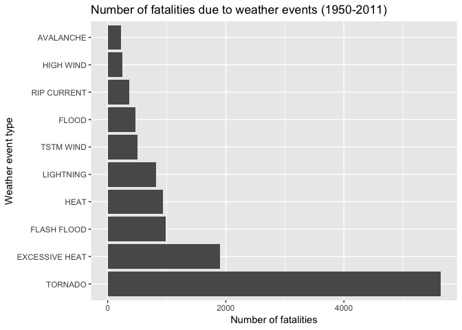
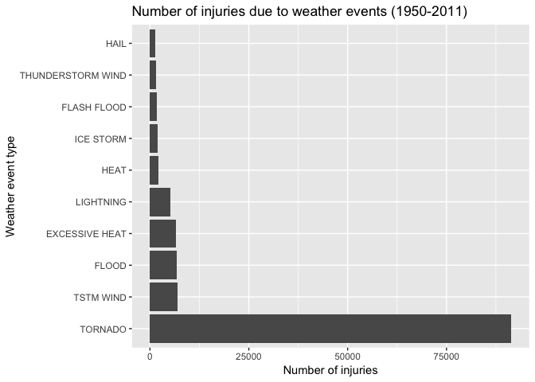
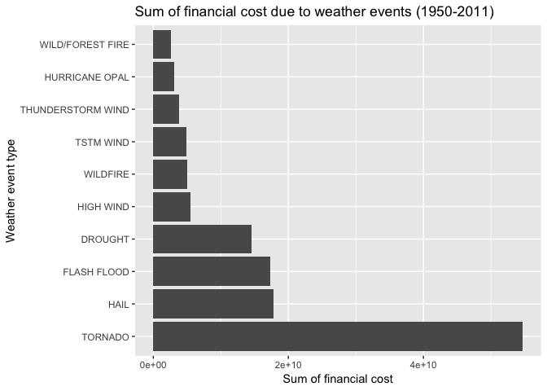

## Synopsis

This report shows that tornadoes are the weather events that have been most harmful to persons, property and crops in the time period 1950 to 2011. The results are based on analysis of storm data from the U.S. National Oceanic and Atmospheric Administration's (NOAA).

## Limitations and assumptions of analysis

- For financial cost of weather events: inflation is not accounted for.
- The aggregated effect of severe weather events in the entire U.S. is evaluated.
- It is assumed that the sum of injuries/fatalities and financial cost for the entire time period may be an indicator of how harmful or consequential an event is. 
- For financial cost of weather events, it is assumed that:
    - H,h = 100
    - K,k = 1 000
    - M,m = 1 000 00
    - B,b = 1 000 000 000
    - Other factors are ignored and interpreted as 1
- Property or crop damage entries with typos (i.e. not in a number format) are ignored.
- We use the event types provided. The data set is large and we assume that the effect from event types with typos, etc. is negligible.

## Data Processing
This project involves exploring the U.S. National Oceanic and Atmospheric Administration's (NOAA) storm database. This database tracks characteristics of major storms and weather events in the United States, including when and where they occur, as well as estimates of any fatalities, injuries, and property damage. [The data for this report is a comma-separated-value file compressed via the bzip2 algorithm.](https://d396qusza40orc.cloudfront.net/repdata%2Fdata%2FStormData.csv.bz2)

### Load and read data
The following code shows how the data is downloaded into R.

```r
# Install required packages if necessary
# install.packages("dplyr")
# install.packages("tidyverse")
# install.packages("reshape2")
# install.packages("tidyr")

# Load packages
library(dplyr)
library(tidyverse)
library(reshape2)
library(tidyr)

# Create folder 'data' if not already existing
if(!file.exists("./data")) {
  dir.create("./data")
}

# Download .csv file if not already existing in 'data'
file <- './data/storm_data.csv.bz2'
       if(!file.exists(file))
        {
               fileUrl <- "https://d396qusza40orc.cloudfront.net/repdata%2Fdata%2FStormData.csv.bz2"
                download.file(fileUrl, destfile = "./data/storm_data.csv.bz2", method = "curl")   
        }
```

The following code shows how the data is loaded into R and read into a data frame.

```r
# Create data frame df from read.csv
df <- read.csv("./data/storm_data.csv.bz2",
               header = TRUE,
               quote = "\"'",
               strip.white = TRUE,
               stringsAsFactors = F,
               sep = ",")

# Confirm that the dimensions of the data frame is correct
dim(df)
```

```
## [1] 902297     37
```

### Simplify data frame
Remove columns that are not relevant for answering the relevant questions. As mentioned in the limitiations, we only evaluate the aggregated effect of severe weather on health and economy. Hence, all columns describing time and location is removed.

```r
# Identify columns to be removed
drop <- c("STATE__", "BGN_DATE", "BGN_TIME", "TIME_ZONE", "COUNTY", "COUNTYNAME", "STATE", "BGN_RANGE", "BGN_AZI","BGN_LOCATI", "END_DATE", "END_TIME", "COUNTY_END", "COUNTYENDN", "END_RANGE", "END_AZI", "END_LOCATI", "LENGTH", "WIDTH", "F", "MAG", "WFO","STATEOFFIC", "ZONENAMES", "LATITUDE", "LONGITUDE", "LATITUDE_E", "LONGITUDE_", "REMARKS", "REFNUM")

# Remove identified columns in data frame to simplify df
df <- df %>% 
        select(-one_of(drop))
```

### Financial cost data frame
Clean the columns for economic damage by combining the number and the factor (thousand, million, billion, etc.). For unknown factors, replace with 1.

```r
# Replace factors with integers for both property damage and crop damage

df<- df %>% 
        mutate(PROPDMGEXP = replace(PROPDMGEXP, PROPDMGEXP == "h", 100)) %>%
        mutate(PROPDMGEXP = replace(PROPDMGEXP, PROPDMGEXP == "H", 100)) %>%
        mutate(PROPDMGEXP = replace(PROPDMGEXP, PROPDMGEXP == "k", 1000)) %>%
        mutate(PROPDMGEXP = replace(PROPDMGEXP, PROPDMGEXP == "K", 1000)) %>%
        mutate(PROPDMGEXP = replace(PROPDMGEXP, PROPDMGEXP == "m", 10^6)) %>%
        mutate(PROPDMGEXP = replace(PROPDMGEXP, PROPDMGEXP == "M", 10^6)) %>%
        mutate(PROPDMGEXP = replace(PROPDMGEXP, PROPDMGEXP == "b", 10^9)) %>%
        mutate(PROPDMGEXP = replace(PROPDMGEXP, PROPDMGEXP == "B", 10^9)) %>%
        as.data.frame()

df<- df %>% 
        mutate(CROPDMGEXP = replace(CROPDMGEXP, CROPDMGEXP == "h", 100)) %>%
        mutate(CROPDMGEXP = replace(CROPDMGEXP, CROPDMGEXP == "H", 100)) %>%
        mutate(CROPDMGEXP = replace(CROPDMGEXP, CROPDMGEXP == "k", 1000)) %>%
        mutate(CROPDMGEXP = replace(CROPDMGEXP, CROPDMGEXP == "K", 1000)) %>%
        mutate(CROPDMGEXP = replace(CROPDMGEXP, CROPDMGEXP == "m", 10^6)) %>%
        mutate(CROPDMGEXP = replace(CROPDMGEXP, CROPDMGEXP == "M", 10^6)) %>%
        mutate(CROPDMGEXP = replace(CROPDMGEXP, CROPDMGEXP == "b", 10^9)) %>%
        mutate(CROPDMGEXP = replace(CROPDMGEXP, CROPDMGEXP == "B", 10^9)) %>%
        as.data.frame()


# For remaining factors, replace with 1
# First, proporty damage
df <- df %>%
        mutate(PROPDMGEXP = ifelse((PROPDMGEXP != 100 & PROPDMGEXP != 1000 & PROPDMGEXP != 10^6 & PROPDMGEXP != 10^9), 1, PROPDMGEXP))

#Second, crop damage
df <- df %>%
        mutate(CROPDMGEXP = ifelse((CROPDMGEXP != 100 & CROPDMGEXP != 1000 & CROPDMGEXP != 10^6 & CROPDMGEXP != 10^9), 1, CROPDMGEXP))
```

Find final value in economic consequence by combining the two columns (number and factor - thousands, millions, etc.).

```r
# Remove unneccesary columns and find the number of financial cost.
harm_economy <- df %>%
        select(-one_of(c("FATALITIES", "INJURIES"))) %>%
        mutate(PROP = as.integer(PROPDMG) * as.integer(PROPDMGEXP)) %>%
        mutate(CROP = as.integer(CROPDMG) * as.integer(CROPDMGEXP))
```

```
## Warning in as.integer(PROPDMG) * as.integer(PROPDMGEXP): NAs produced by
## integer overflow
```

```
## Warning in as.integer(CROPDMG) * as.integer(CROPDMGEXP): NAs produced by
## integer overflow
```

Remove additional columns to simplify data frame.

```r
# Remove additional columns to make data frame as simple as possible
harm_economy <- harm_economy %>%
        select(-one_of(c("PROPDMG","PROPDMGEXP","CROPDMG","CROPDMGEXP")))
```

After the financial costs are found - find the top 10 event types by combining and summarizing damage to property and crop.
Summarize the harm from different event types (economic).

```r
# Create a new simplified data frame for economic harm from weather events. Summarize for each event type. Only keep top 10 and sort.
harm_economy <- harm_economy %>%
      gather(harm_type, cost, PROP:CROP) %>%
        group_by(EVTYPE) %>%
        summarise(sum_harm = sum(as.numeric(cost))) %>%
        top_n(n = 10, wt = sum_harm) %>%
        arrange(desc(sum_harm))

# Show the top 10 harmful weather events for financial cost
harm_economy
```

```
## # A tibble: 10 x 2
##    EVTYPE               sum_harm
##    <chr>                   <dbl>
##  1 TORNADO           54684981458
##  2 HAIL              17800211845
##  3 FLASH FLOOD       17328606556
##  4 DROUGHT           14493502000
##  5 HIGH WIND          5514598035
##  6 WILDFIRE           4986864000
##  7 TSTM WIND          4943390055
##  8 THUNDERSTORM WIND  3859649144
##  9 HURRICANE OPAL     3091846000
## 10 WILD/FOREST FIRE   2588962000
```

### Population health data frame
Simplify data frames for harm to persons. Find the top 10 event types and sort.

```r
# Remove unneccesary columns for harm to persons
harm_person <- df %>%
        select(-one_of(c("PROPDMG","PROPDMGEXP","CROPDMG","CROPDMGEXP")))

# Create separate data frames for fatalities and injuries. Summarize for each event type. Only keep top 10 and sort.
harm_person_fat <- harm_person %>% 
        select(EVTYPE, FATALITIES) %>%
        group_by(EVTYPE) %>%
        summarise(sum_harm = sum(FATALITIES)) %>%
        top_n(n = 10, wt = sum_harm) %>%
        arrange(desc(sum_harm))

harm_person_inj <- harm_person %>% 
        select(EVTYPE, INJURIES) %>%
        group_by(EVTYPE) %>%
        summarise(sum_harm = sum(INJURIES)) %>%
        top_n(n = 10, wt = sum_harm) %>%
        arrange(desc(sum_harm))

# Show the top 10 harmful weather events to persons
harm_person_fat
```

```
## # A tibble: 10 x 2
##    EVTYPE         sum_harm
##    <chr>             <dbl>
##  1 TORNADO            5633
##  2 EXCESSIVE HEAT     1903
##  3 FLASH FLOOD         978
##  4 HEAT                937
##  5 LIGHTNING           816
##  6 TSTM WIND           504
##  7 FLOOD               470
##  8 RIP CURRENT         368
##  9 HIGH WIND           248
## 10 AVALANCHE           224
```

```r
harm_person_inj
```

```
## # A tibble: 10 x 2
##    EVTYPE            sum_harm
##    <chr>                <dbl>
##  1 TORNADO              91346
##  2 TSTM WIND             6957
##  3 FLOOD                 6789
##  4 EXCESSIVE HEAT        6525
##  5 LIGHTNING             5230
##  6 HEAT                  2100
##  7 ICE STORM             1975
##  8 FLASH FLOOD           1777
##  9 THUNDERSTORM WIND     1488
## 10 HAIL                  1361
```

## Results
The basic goal of this assignment is to explore the NOAA Storm Database and answer some basic questions about severe weather events.

### Population health
- **Across the United States, which types of events (as indicated in the EVTYPE variable) are most harmful with respect to population health?**

Number of fatalities due to a weather event is shown in the figure below.

```r
# Plot bar chart for fatalities, ordered
p <- ggplot(harm_person_fat, aes(x = reorder(EVTYPE, -sum_harm), sum_harm)) + geom_col(position = position_stack(reverse = TRUE)) + coord_flip() + xlab("Weather event type") + ylab("Number of fatalities") + ggtitle("Number of fatalities due to weather events (1950-2011)")
p
```

<!-- -->

Number of injuries due to a weather event is shown in the figure below.

```r
# Plot bar chart for injuries, ordered
p <- ggplot(harm_person_inj, aes(x = reorder(EVTYPE, -sum_harm), sum_harm)) + geom_col(position = position_stack(reverse = TRUE)) + coord_flip() + xlab("Weather event type") + ylab("Number of injuries") + ggtitle("Number of injuries due to weather events (1950-2011)")
p
```

<!-- -->

The figures above show that tornodoes are the most harmful weather events to persons (both injuries and fatalities). Based on the fatalities from 1950 to 2011, *excessive heat* and *heat* are weather event types which are ranked second and fourth. Hence, it could be added that heat-related events are among the most harmful with respect to population health, in addition to tornadoes - which by far is the most harmful event (from 1950 to 2011).

### Economic consequence
- **Across the United States, which types of events have the greatest economic consequences?**

The financial cost due to weather events is shown in the figure below.

```r
# Plot bar chart for financial cost, ordered
p <- ggplot(harm_economy, aes(x = reorder(EVTYPE, -sum_harm), sum_harm)) + geom_col(position = position_stack(reverse = TRUE)) + coord_flip() + xlab("Weather event type") + ylab("Sum of financial cost") + ggtitle("Sum of financial cost due to weather events (1950-2011)")
p
```

<!-- -->

The figure above shows that tornadoes are the weather events with the highest financial cost (property and crop damage) for the time period 1950-2011. Hail, flash floods and droughts are weather events with large economic consequence, but they are all considerably lower that the consequence from tornadoes.
